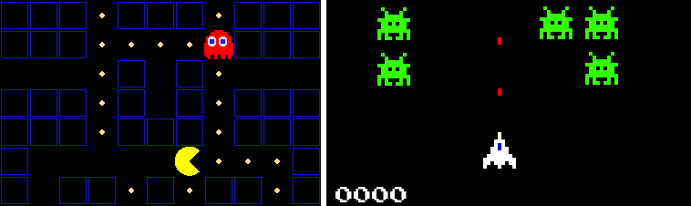

Versionsstyring med Git og GitHub
=================================

Dette er en introduktion til konceptet versionsstyring
og en tutorial i brug versionsstyringssystemet **Git**
vha. webservicen **GitHub**
og editoren/udviklingsmiljøet  **Visual Studio Code**.
Introduktionen til grundlæggende versionsstyring med Git
benytter et generisk arkadespil (Space Shooter) som eksempel
og introduktionen til samarbejde vha Git og GitHub 
benytter en klon af arkadespillet Pac-Man som eksempel.
Begge spil skrevet i Python vha. biblioteket Pygame.

Materialet er designet til at blive læst i kapitlernes numeriske rækkefølge:

* Start med kapitlet :doc:`ch-intro/intro` 
  som motiverer og introducerer konceptet versionsstyring.

* Installér og opsæt dernæst de værktøjer som bruges i tutorialen
  ved at følge instruktionerne i :doc:`ch-setup/setup`.
  Alle værktøjer fungere på de tre store platforme Windows, macOS og Linux.

* Følg endeligt tutorialen i kapitel :doc:`ch-basic-git/basic-git`.

.. toctree::
   :maxdepth: 2
   :caption: Indhold
   :numbered:

   ch-intro/intro
   ch-setup/setup
   ch-basic-git/basic-git

